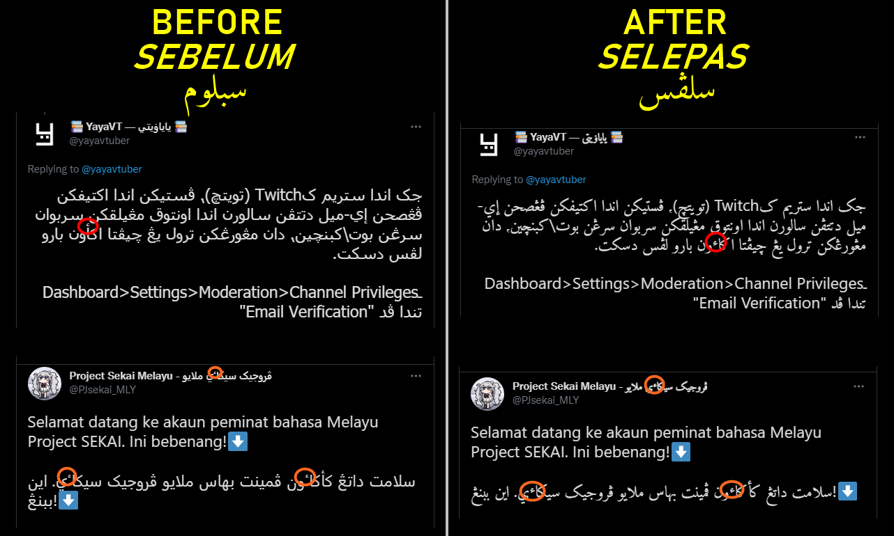

# Jawi Stylus

Add support to display Jawi properly across websites.

*Tambah sokongan paparan Jawi yang betul ke atas kesemua laman sesawang.*

<strong>تمبه سوکوڠن ڤاڤرن جاوي يڠ بتول کأتس کسموا لامن سساوڠ.</strong>

## Installation / Pemasangan / ڤماسڠن

### English

1. Download and install Amiri font from [their website](https://www.amirifont.org/).
2. Install Stylus from your browser's extension marketplace:
   - [Firefox](https://addons.mozilla.org/en-US/firefox/addon/styl-us/)
   - [Chrome](https://chrome.google.com/webstore/detail/stylus/clngdbkpkpeebahjckkjfobafhncgmne)
   - [Opera](https://addons.opera.com/en-gb/extensions/details/stylus/)
   - [Safari (Cascadea)](https://cascadea.app/).
3. Install [jawi-stylus.user.css](https://raw.githubusercontent.com/jawi-mnh48/jawi-stylus/main/jawi-stylus.user.css).

### Bahasa Melayu (Rumi)

1. Muat turun dan pasang fon Amiri daripada [laman sesawang mereka](https://www.amirifont.org/).
2. Pasang Stylus daripada pasaran sambungan pelayar anda:
   - [Firefox](https://addons.mozilla.org/en-US/firefox/addon/styl-us/)
   - [Chrome](https://chrome.google.com/webstore/detail/stylus/clngdbkpkpeebahjckkjfobafhncgmne)
   - [Opera](https://addons.opera.com/en-gb/extensions/details/stylus/)
   - [Safari (Cascadea)](https://cascadea.app/).
3. Pasang [jawi-stylus.user.css](https://raw.githubusercontent.com/jawi-mnh48/jawi-stylus/main/jawi-stylus.user.css).

    <h3>بهاس ملايو (جاوي)</h3>
    <ol>
        <li>موات تورون دان ڤاسڠ فوم أمیری درڤد <a href="https://www.amirifont.org/" rel="nofollow">لامن سساوڠ مريک</a>.</li>
        <li>ڤاسڠ Stylus درڤد ڤاسرن سمبوڠن ڤلاير اندا:<ul>
            <li><a href="https://addons.mozilla.org/en-US/firefox/addon/styl-us/" rel="nofollow">Firefox</a></li>
            <li><a href="https://chrome.google.com/webstore/detail/stylus/clngdbkpkpeebahjckkjfobafhncgmne" rel="nofollow">Chrome</a></li>
            <li><a href="https://addons.opera.com/en-gb/extensions/details/stylus/" rel="nofollow">Opera</a></li>
            <li><a href="https://cascadea.app/" rel="nofollow">Safari (Cascadea)</a>.</li>
        </ul></li>
        <li>ڤاسڠ <a href="https://raw.githubusercontent.com/jawi-mnh48/jawi-stylus/main/jawi-stylus.user.css" rel="nofollow">jawi-stylus.user.css</a>.</li>
    </ol>

## License / Lesen / ليسين
MIT
